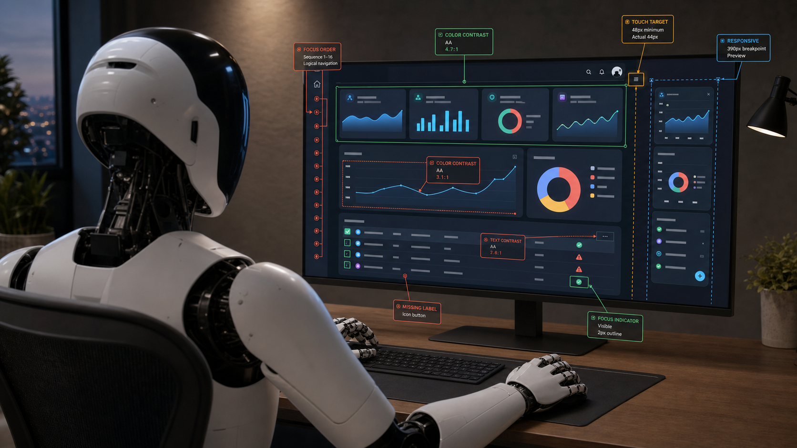

# a11y-agent



A CLI agent that audits web pages for accessibility, layout, and mobile issues — driving real headless Chromium (agent-browser) and streaming its findings to your terminal.

## Why?

With agents everyone is writing orders of magnitude more software. Token usage is exploding. Yet the average software experience is still buggy, unreliable, and built without care. We should be spending just as many tokens making our software reliable, accessible, and polished as we do generating it. With agents, we suddenly have the bandwidth to test edge cases and ensure our product feels great on all platforms and devices.

`a11y-agent` walks the floor of your product — testing features, spotting issues, and finding what needs polish. Below is a real accessibility audit of the Tavily Dashboard, with genuine findings. It also works on pages search engines can't reach — like authenticated dashboards — as requested in [tavily-python#163](https://github.com/tavily-ai/tavily-python/issues/163).

**→ [Read the report](examples/tavily-home/report.md)**

## How I built this

Unfortunately, due to a Claude Code behavior that [skips saving transcripts inside child
sessions][claude-child-session] (an inherited `CLAUDE_CODE_CHILD_SESSION` env marker —
silent until v2.1.217 added a warning), I lost the `.jsonl` transcript of the build
session. However, I was able to reconstruct most of it from what did survive — subagent
metadata, file-history snapshots, git commits, and an independent Codex review log — and
turned it into a webpage:

**→ [how-i-built-a11y-agent.vercel.app](https://how-i-built-a11y-agent.vercel.app/)**

[claude-child-session]: https://code.claude.com/docs/en/env-vars#:~:text=CLAUDE_CODE_CHILD_SESSION

## Setup

1. Create a [Tavily API key](https://app.tavily.com).
2. Create a [Nebius API key](https://tokenfactory.nebius.com).
3. Copy `.env.example` to `.env` and fill in both keys:

   ```sh
   cp .env.example .env
   ```

4. Install `agent-browser` (an external Rust CLI, **>= 0.33.0** for the a11y audit):

   ```sh
   npm install -g agent-browser   # or: brew install agent-browser / cargo install agent-browser
   ```

   The CLI checks for it on startup and prints an install hint if it's missing or too old.

## Run

With [uv](https://docs.astral.sh/uv/) (no install step needed):

```sh
uv run main.py "take a look at example.com/pricing and show me some accessibility issues"
```

The agent chooses its own tools based on your prompt — auditing a single page, or
mapping a site and auditing a few representative pages:

```sh
uv run main.py "map the pages on example.com and audit a couple of them on mobile"
```

Or install the package and use the console script:

```sh
uv pip install -e .
a11y-agent "open example.com and run an accessibility audit"
```

Pick a different model with `--model`, or set `A11Y_AGENT_MODEL` in `.env`
(the default, Kimi K2.6, is vision-capable so it can look at screenshots):

```sh
uv run main.py --model "moonshotai/Kimi-K2.6" "..."
```

Model resolution order: `--model` flag → `A11Y_AGENT_MODEL` env var → built-in default.

## Auditing logged-in pages (autoconnect)

By default the agent launches a fresh, isolated Chromium — great for public pages, but it
has none of your cookies. To audit pages behind a login (dashboards, apps, anything gated
by auth), point agent-browser at your **already-running Chrome** so it reuses that
session:

1. Quit Chrome, then relaunch it with remote debugging enabled, and log into the site:

   ```sh
   # macOS
   "/Applications/Google Chrome.app/Contents/MacOS/Google Chrome" --remote-debugging-port=9222
   ```

   Some recent Chrome builds only allow remote debugging on a non-default profile — add
   `--user-data-dir="$HOME/chrome-debug"` and sign in there if the attach is refused.

2. Run the agent with autoconnect on — it discovers and attaches to that Chrome:

   ```sh
   uv run main.py --auto-connect "audit the accessibility of my dashboard at https://app.example.com/home"
   ```

   (`--auto-connect` just sets `AGENT_BROWSER_AUTO_CONNECT=1`; you can export that yourself
   instead.)

Screenshots and audits then reflect the real, authenticated page, and the agent will not
close your browser on exit. Any `AGENT_BROWSER_*` variable you set is forwarded to the
browser (e.g. `AGENT_BROWSER_SCREENSHOT_DIR`); your API keys are not.

## Auditing untrusted pages

The agent has the full agent-browser tool surface, including JavaScript `eval` and
session/state tools. A malicious page could attempt prompt injection to misuse them. When
pointing the agent at pages you don't trust, restrict what the browser can reach:

```sh
AGENT_BROWSER_ALLOWED_DOMAINS="example.com,*.example.com" uv run main.py "audit https://example.com"
```

Keep autoconnect (your logged-in Chrome) for sites you trust.

## Skills

The agent itself is general — search + drive a browser. Task-specific workflows live as
**skills**: a `skills/<name>/SKILL.md` file with YAML frontmatter (`name`, `description`)
and a markdown body. At startup the agent lists each skill's name + description in its
prompt and, when a request matches, calls a `load_skill` tool to pull in the full
instructions (progressive disclosure — bodies only cost tokens when used). This is the
[SKILL.md](https://agentskills.io) open standard, so skills also work in Claude Code.

Ships with a built-in `accessibility-audit` skill (packaged inside `a11y_agent`, so it's
present in installed copies too). Add your own by pointing `A11Y_AGENT_SKILLS_DIR` at a
directory of `<name>/SKILL.md` folders — those are merged in and override built-ins with
the same name.

## Example

A real run against Tavily's logged-in dashboard, driven by this prompt (using
[autoconnect](#auditing-logged-in-pages-autoconnect) so the agent sees the authenticated
page):

```
go to https://app.tavily.com/home with agent browser auto connect and look across
different viewports and annotate / take screenshots of any weird layout issues and
create a markdown file with images showing them. we only need a couple things. i care
more about layout than a11y for this.
```

The agent mapped the page across desktop/tablet/mobile viewports, screenshotted each,
looked at the images, and saved a four-finding report — including the API Keys table
silently dropping its KEY and OPTIONS columns at 375px.

**→ Read the report: [`examples/tavily-home/report.md`](examples/tavily-home/report.md)**
