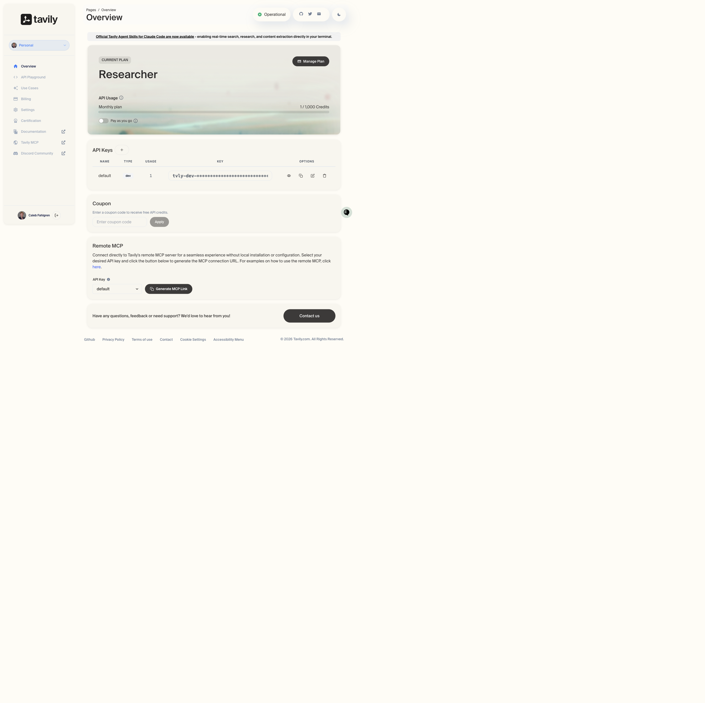
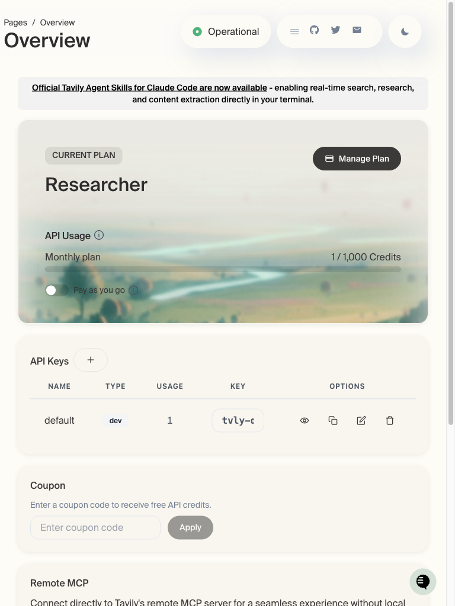
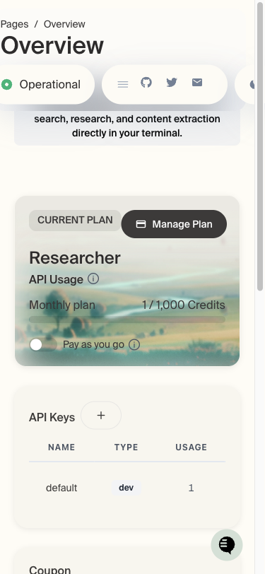
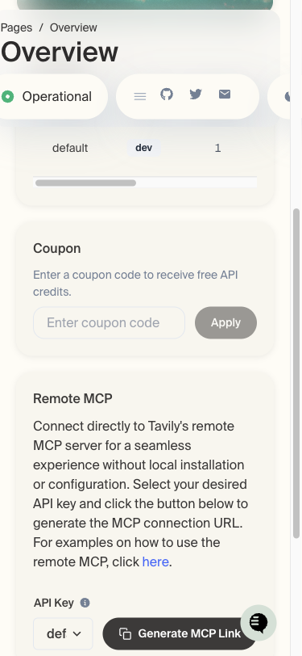
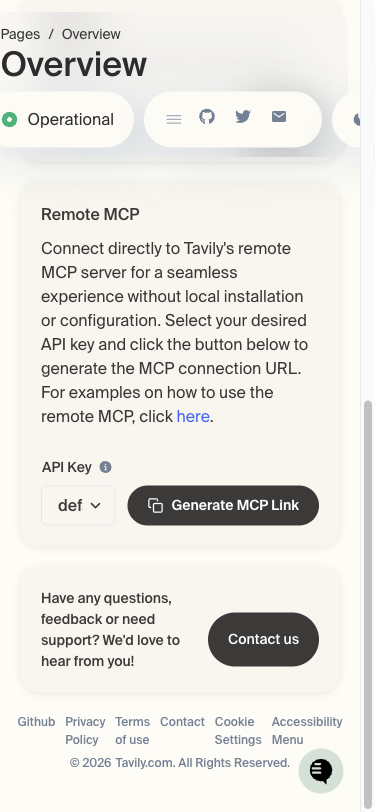

# Tavily App Dashboard — Layout Issues Report

**URL:** https://app.tavily.com/home  
**Date:** Responsive audit across Desktop (1440×900), Tablet (768×1024), and Mobile (375×812)

---

## Desktop (1440×900) — Clean baseline

The desktop layout is well-organized with a sidebar navigation, a clear content area, and proper spacing.

---

## Tablet (768×1024) — Minor overflow issues

The tablet layout is mostly functional, but the **API Keys table** starts truncating the masked key value and crowds the action icons.

- **Issue 1:** The masked `KEY` column is truncated (`tvly-c` instead of the full masked value).
- **Issue 2:** The `OPTIONS` action icons (eye, copy, edit, delete) are visually cramped.

---

## Mobile (375×812) — Several layout problems

### Header Actions — Elements overlapping / cut off

At the top of the page, the "Operational" status pill, the social icons (hamburger, GitHub, Twitter, email), and the theme toggle are squeezed into a tight container. The rightmost elements are partially or fully clipped by the viewport edge.

- **Issue 3:** Header action bar does not properly wrap or collapse. Icons on the far right (possibly theme toggle or additional icons) are cut off.

### API Keys Table — Horizontal overflow

The `API Keys` table extends past its parent container. The `KEY` and `OPTIONS` columns are partially hidden, making action buttons inaccessible without horizontal scrolling.

- **Issue 4:** Table columns (`KEY`, `OPTIONS`) overflow the card width. User cannot see the masked API key or reliably tap action icons (eye, copy, delete).
- **Issue 5:** Horizontal scrollbar appears inside the content area, which is awkward on a narrow touchscreen.

### Footer Links — Awkward wrapping

The footer row breaks to two lines at odd breakpoints, leaving orphaned text and cramped tap targets.

- **Issue 6:** Footer links (`Privacy Policy`, `Terms of use`, `Cookie Settings`, `Accessibility Menu`) wrap poorly, creating ragged lines with orphaned fragments.

### Remote MCP Section — Dropdown truncation

The `API Key` dropdown label is truncated (`def` instead of `default`), and the `Generate MCP Link` button is very wide for the narrow viewport.

- **Issue 7:** The `API Key` select label shows `def` instead of `default` due to width constraints.
- **Issue 8:** The `Generate MCP Link` button nearly spans the entire card width, leaving minimal margin.

---

## Summary

| Viewport | Severity | Issues |
|----------|----------|--------|
| Desktop (1440px) | None | Clean layout |
| Tablet (768px) | Low | API Keys table truncation |
| Mobile (375px) | Medium-High | Header overflow, table overflow, footer wrapping, label truncation |

**Priority fixes for mobile:**
1. Make the header action area collapse into a single `...` menu or wrap gracefully.
2. Convert the `API Keys` table into a stacked card layout (or add a contained horizontal scroll).
3. Stack footer links vertically or use a compact icon grid on narrow screens.
4. Ensure dropdown labels don't clip (e.g., widen the dropdown or truncate with `...`).
